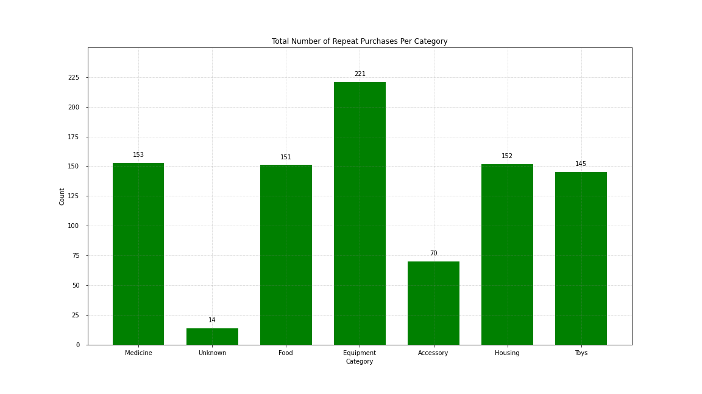
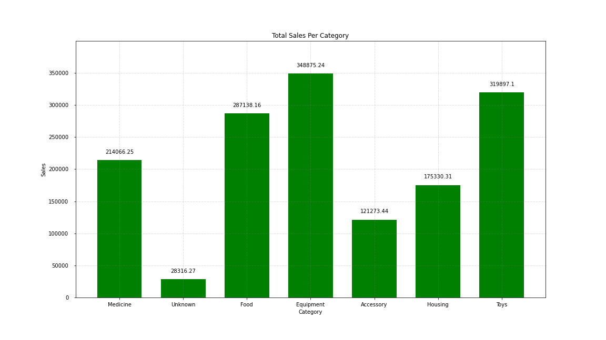
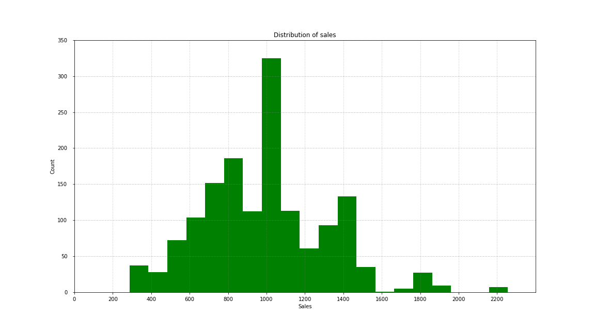
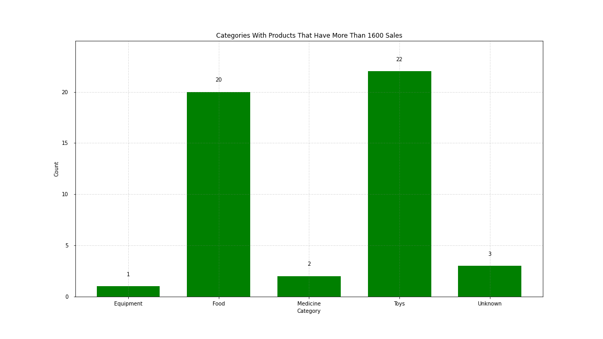
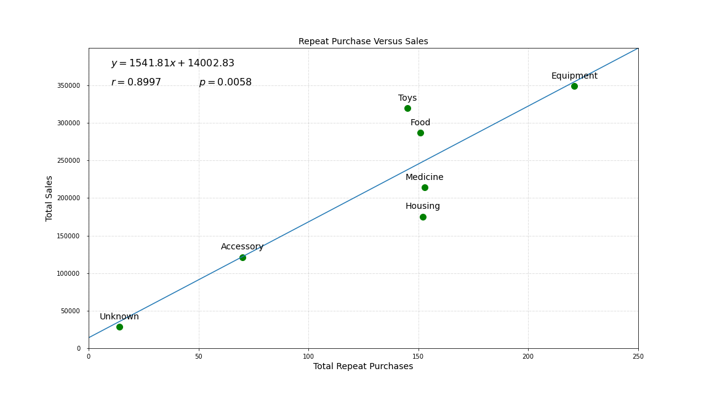

## Task 1

## Data Validation

The original data is **1500** rows and **8** columns. No rows were removed during the data transformation process.

**product_id**: 
- No missing values.

**category**: 
- There were 6 categories as expected (Food, Housing, Medicina, Toys, Equipment, and Accessory). 
- However, missing values were indicated with **"-"** instead of **"Unknown"**. I therefore performed an SQL query to replace "-" with "Unknown" in the category column.

**animal**: 
- There are 4 animal type as expected (Bird, Dog, Cat, Fish). There were no missing value in the table.

**size**: 
- 	There are 3 sizes as expected (Small, Medium, Large). There were no missing values. 
- 	However, the capitalization is inconsistent. To resolve this inconsistency, I use the INITCAP() function to capitalize the first letter only for all sizes.

**price**: 
- 	Missing prices have a value of "unlisted". I calculated the **Median** of all listed prices using PERCENTILE_DISC(0.50) function, then replace all "unlisted" prices with the median price. 
- 	Some prices have none or only 1 decimal places. None of the prices have more than 2 decimal places. I used the ROUND(price::NUMERIC, 2) function to ensure every price has 2 decimal places. 

**sales**
- 	There were no missing sales value. Some sales value have none or only 1 decimal place. I used the ROUND(sales::NUMERIC, 2) function to ensure every price has 2 decimal places. 

**ratings**: 
- 	Ratings are discrete values from 1 to 10, as expected.
- 	Missing values were listed as "NA". I performed a SQL replace function to replace "NA" with "0"

**repeat_purchase**:
- 	Some repeate_purchase values are -0 instead of 0. These were fixed to be 0.
- 	There are only 2 nominal values, 0 and 1, as expected.
- 	There were null values in the repeat_purchase column

## Task 2

## Data Discovery and Visualization

### Which category has the most repeat purchases?

There are seven possible product categories included in this data. The most common category that customers repeatedly purchase from is Equipment.

This would suggest that PetMind should focus on developing products from the Equipment category.

The 2nd, 3rd, 4th and 5th most common categories are Housing, Food, Medicine and Toys, respectively. They only have two thirds (2/3) as many instances of repeat purchases as the 1st most commont category, Equipment. However, observations are balanced and approximately the same across the 2nd, 3rd, 4th and 5th most common categories.

It is interesting to note that eventhough Toys are Luxury items, the Toys category has as many repeat purchases as the Food category, which is classified as Everyday items.

Accessory seems to be perceived as a Luxury item by consumers, with only half as many repeat purchases as Housing, Food, Medicine and Toys.

## Task 3

### Describe the distribution of all sales across categories.

As PetMind wants to see how repeat purchase impacts sales, we should look at how sales is distributed. Looking at the total sales value per category, we can see that Equipment, which has the most repeat purchases, also have the highest total sales value. This indicates that increasing sales by selling more everyday product repeatedly might be an effective marketing strategy.

However, we may also notice that Toys has the 2nd highest total sales value, followed closely by Food, with the 3rd highest total sales value. These are also product categories with higher number of repeated purchases.

Overall, this trend indicates that increasing sales by selling products that have a high observation of repeated purchases is an effective marketing strategy.

## Describe the Distribution of Sales in General

As PetMind is focusing on increasing sales, we should look at how sales are distributed. Looking at all sales, we can see that most products have  less than 1200 sales. There are some outliers that get more than 1600 sales, with some generate as high as 2200 sales, but this is relatively uncommon. When determining which product category to increase sales in, PetMind should focus on products in categories that have more than 1200 sales. Furthermore, the company should aim to identiy which category / categories generate unusally high sales (>1600).

I performed an SQL query to see which categories have products that generate more than 1600 sales. The results are really surprising. Eventhough Equipment is the category with the highest observations of repeat purchases and highest total sales across all of its products, it only has 1 product that generates more than 1600 sales.

In contrast, eventhough Toys and Food have less repeat purchases and total sales revenue across all their products, they have more special products that generate unusually high sales values. PetMind may want to identify these high-sales products and develop a marketing strategy to sell more of these products specifically.

## Task 4

## Describe the relationship between repeat purchase and sales

Finally we want to combine the two pieces of information to see how the number of repeat purchases impacts sales. So far categories with a higher number of repeat purchases generate more absolute sales value.

The correlation coefficient _r_ between the number of repeat purchases and sales is r = 0.8997, indicating a strong, positive linear relationship. The _p-value_ is p = 0.0058, indicating that the probability that the true value of _r_ is 0 (no correlation) is less than 0.6%, which is very highly unlikely. Therefore, we have significant statistics evident that categories with higher number of repeat purchase helps generate more sales.

The linear model **y = 1541.81x + 14002.83** helps describe this linear relationship.

Nonetheless, when looking at categories such as Toys, Food, Medicine and Housing, we see that the linear trend is not entirely applicable: It is difficult to use the linear model **y = 1541.81x + 14002.83**  to predict sales for any of those 4 categories based on their number of repeat purchases. We may need to investigate further to identify what drives the differences in sales between those 4 categories, despite their roughly similar number of repeat purchases.

## Conclusion

Based on all of the above, we would recommend that PetMind focus on increasing sales by selling more products in the Equipment categories. 

The company should also consider selling more Toys, a Luxury category, to generate more sales, instead of only Everyday items.

Further analysis should be done to understand why categories with roughly similar observations of repeat purchases may have significant differences in total sales value (Toys, Food, Medicine and Housing). The company may be able to research other hidden factors that drive salves, and develop new marketing strategies to increase sales based on those factors, instead of only on repeat purchases.
